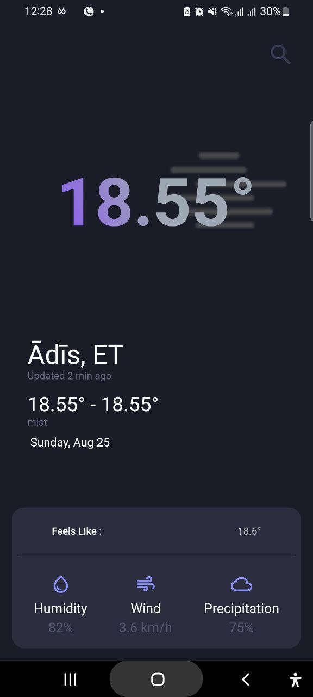
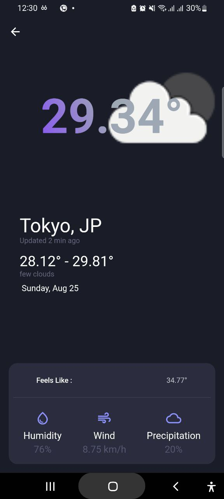

# Weather-App
# Weather Forecast App

This is a Flutter application that displays weather information based on the user's current location and allows users to search for weather details of any city by name. The app fetches weather data from a public API and displays it in a user-friendly interface. It also provides functionality to search for a city's weather and view detailed weather information when a search result is clicked.

## Features

- **Current Location Weather**: Displays the current weather information based on the user's geolocation.
- **Search Functionality**: Users can search for a city by name to view the weather details of that city.
- **Weather Details**: Clicking on a search result provides detailed weather information.

## Screens

1. **Home Page**:
   - Shows the weather information of the user's current location.
   - Automatically fetches the weather using the device's geolocation when the app is opened.

2. **Search Page**:
   - Allows the user to search for weather information by entering a city name.
   - Displays search results, and tapping on a result shows the weather details for that city.

## Technologies Used

- **Flutter**: Cross-platform UI toolkit for building natively compiled applications.
- **Dart**: Programming language used for Flutter development.
- **Geolocator**: A Flutter plugin used to fetch the device's current location (latitude and longitude).
- **HTTP**: A Flutter package used to make HTTP requests to the weather API.
- **OpenWeatherMap API**: Public API used to fetch weather data.


## How to Run the App

### Prerequisites

- [Flutter](https://flutter.dev/docs/get-started/install) installed on your machine.
- A [Weather API key](https://openweathermap.org/) from OpenWeatherMap.

### Setup

1. Clone the repository:

   ```bash
   git clone https://github.com/your-username/weather-forecast-app.git
2. Navigate into the project directory:
   
   ```bash
   cd weather-forcast-app
   ```
3. Install the required dependencies:
   
   ```bash
   flutter pub get
   ```
4. Add your OpenWeatherMap API key:
  create .env file in root directory and add your API key

   ```bash
   API_KEY=[Your actual api key]
6. Run the app on your device or emulator:

   ```bash
   flutter run
### Prerequisites
   
   
   
   
  
  
  

